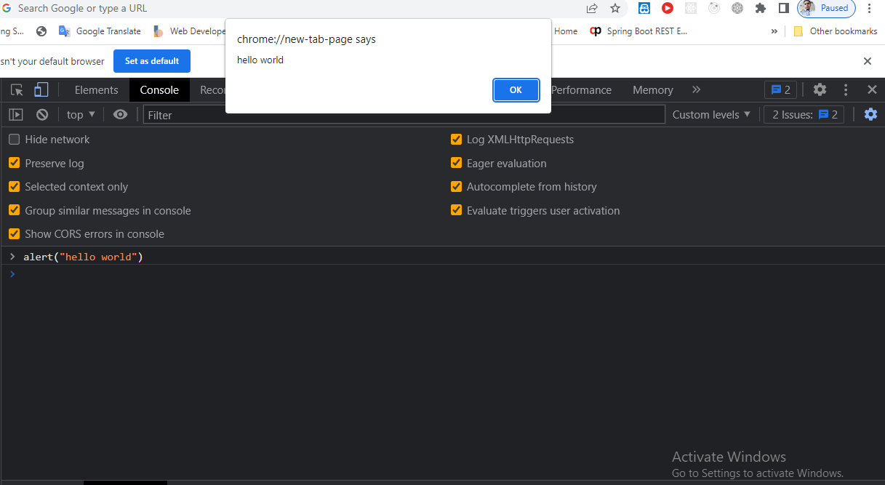
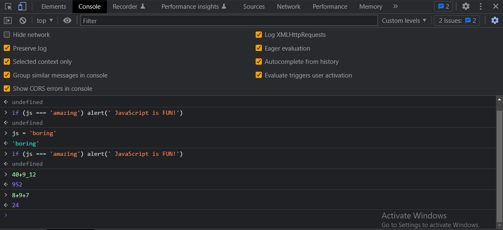

alert("Hello world") 

 
\*\*\* javascript is a high-level object-oriented, multi-paradigm programming language(High-Level = > we don't have to worry about complex stuff like memory management   Object-Oriented = > Based on objects, for storing most kinds of data   Multi-paradigm programming language = > we can use different styles of programming   Programming = > instruct computer to do things) \*\*\*  

https://www.w3schools.com/js/js_history.asp
